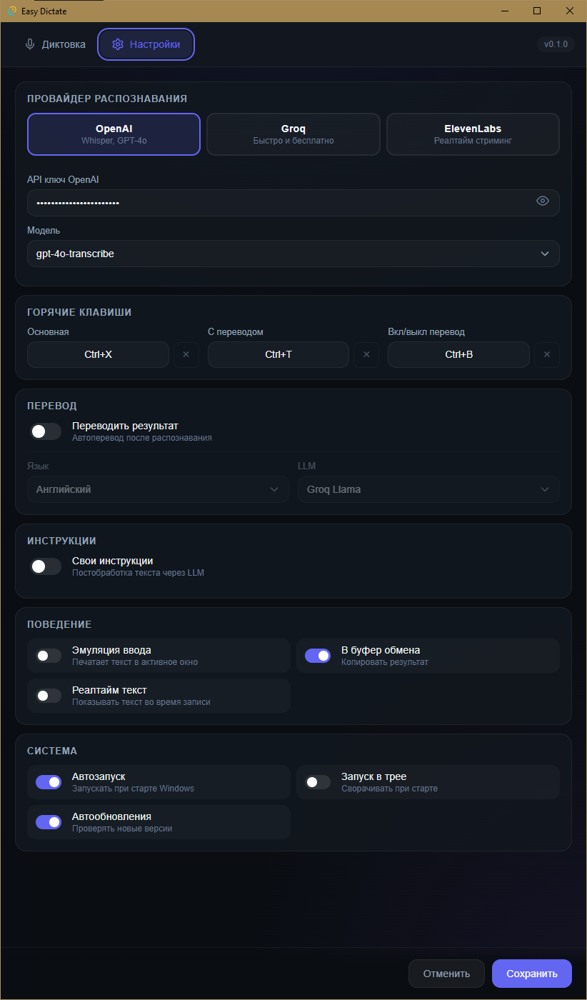

# Easy Dictate

Десктопное приложение для голосового ввода текста с AI-транскрибацией. Нажал горячую клавишу — надиктовал — текст появился в любом приложении.



## Возможности

- **Push-to-talk диктовка** — удерживайте горячую клавишу и говорите
- **3 провайдера транскрибации** — OpenAI Whisper, Groq (бесплатно), ElevenLabs (реалтайм)
- **Автоперевод** — автоматический перевод на нужный язык после распознавания
- **Свои инструкции** — постобработка текста через LLM (резюме, форматирование и т.д.)
- **Эмуляция ввода** — текст печатается в активное окно как с клавиатуры
- **Работа в фоне** — системный трей, автозапуск, горячие клавиши
- **Автообновления** — приложение обновляется автоматически

## Установка

### Готовые сборки

Скачайте последнюю версию для вашей ОС:

- **Windows**: `.msi` или `.exe` инсталлятор
- **macOS**: `.dmg` (Intel и Apple Silicon)
- **Linux**: `.deb` или `.AppImage`

[Скачать последнюю версию](https://github.com/RuKapSan/easy-dictate/releases/latest)

### Сборка из исходников

```bash
git clone https://github.com/RuKapSan/easy-dictate.git
cd easy-dictate/src-tauri
cargo tauri build
```

Требования: Rust 1.77+, Node.js 18+

## Быстрый старт

1. Установите приложение
2. Выберите провайдера (Groq — бесплатный)
3. Введите API ключ
4. Нажмите горячую клавишу (по умолчанию `Ctrl+Shift+Space`)
5. Говорите — текст появится в активном окне

## Горячие клавиши

| Клавиша | Действие |
|---------|----------|
| Основная | Запись и транскрибация |
| С переводом | Запись + принудительный перевод |
| Вкл/выкл перевод | Переключить автоперевод |

Все клавиши настраиваются в разделе "Настройки".

## Провайдеры

| Провайдер | Скорость | Цена | Особенности |
|-----------|----------|------|-------------|
| **Groq** | Быстро | Бесплатно | Whisper Large v3 |
| **OpenAI** | Средне | Платно | GPT-4o Transcribe |
| **ElevenLabs** | Реалтайм | Платно | Стриминг текста во время речи |

## Технологии

- **Tauri v2** + Rust (backend)
- **HTML/CSS/JS** (frontend, без фреймворков)
- **cpal** (аудио захват)

## Лицензия

MIT

## Ссылки

- [Releases](https://github.com/RuKapSan/easy-dictate/releases)
- [Issues](https://github.com/RuKapSan/easy-dictate/issues)
