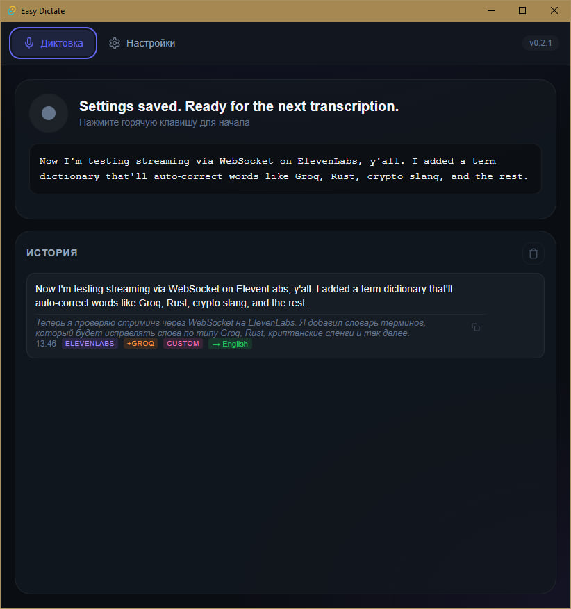

# Easy Dictate

[](https://github.com/RuKapSan/easy-dictate/releases/latest)
[](LICENSE)

**[English version](README.md)**

Десктопное приложение для голосового ввода текста с AI-транскрипцией. Нажмите горячую клавишу, говорите, текст появится в любом приложении.



## Возможности

- **Диктовка по нажатию** — удерживайте горячую клавишу и говорите
- **3 провайдера транскрипции** — OpenAI Whisper, Groq (бесплатно), ElevenLabs (потоковая передача в реальном времени)
- **Авто-перевод** — автоматический перевод на целевой язык после транскрипции
- **Свои инструкции** — постобработка текста через LLM (резюмирование, форматирование и т.д.)
- **Словарь терминов** — автокоррекция технических терминов (Groq, Tauri, WebSocket и т.д.)
- **История транскрипций** — просмотр, копирование и управление прошлыми транскрипциями
- **Эмуляция ввода** — текст вводится в активное окно как с клавиатуры
- **Фоновая работа** — системный трей, автозапуск, глобальные горячие клавиши
- **Автообновления** — автоматические обновления из GitHub релизов


## Установка

### Готовые сборки

Скачайте последнюю версию для вашей ОС:

- **Windows**: `.msi` или `.exe` установщик
- **macOS**: `.dmg` (Intel и Apple Silicon)
- **Linux**: `.deb` или `.AppImage`

[Скачать последний релиз](https://github.com/RuKapSan/easy-dictate/releases/latest)

### Сборка из исходников

```bash
git clone https://github.com/RuKapSan/easy-dictate.git
cd easy-dictate/src-tauri
cargo tauri build
```

Требования: Rust 1.77+, Node.js 18+

## Быстрый старт

1. Установите приложение
2. Выберите провайдера (Groq бесплатный)
3. Введите API ключ
4. Нажмите горячую клавишу (по умолчанию: `Ctrl+Shift+Space`)
5. Говорите — текст появится в активном окне

## Горячие клавиши

| Горячая клавиша | Действие |
|-----------------|----------|
| Основная | Запись и транскрипция |
| С переводом | Запись + принудительный перевод |
| Вкл/выкл перевод | Переключение авто-перевода |

Все горячие клавиши настраиваются в Настройках.

## Провайдеры

| Провайдер | Скорость | Цена | Особенности |
|-----------|----------|------|-------------|
| **Groq** | Быстро | Бесплатно | Whisper Large v3 |
| **OpenAI** | Средне | Платно | GPT-4o Transcribe |
| **ElevenLabs** | Реалтайм | Платно | Потоковый текст во время речи |

## Технологии

- **Tauri v2** + Rust (бэкенд)
- **HTML/CSS/JS** (фронтенд, без фреймворков)
- **cpal** (захват аудио)

## Лицензия

MIT

## Ссылки

- [Релизы](https://github.com/RuKapSan/easy-dictate/releases)
- [Сообщить о проблеме](https://github.com/RuKapSan/easy-dictate/issues)
